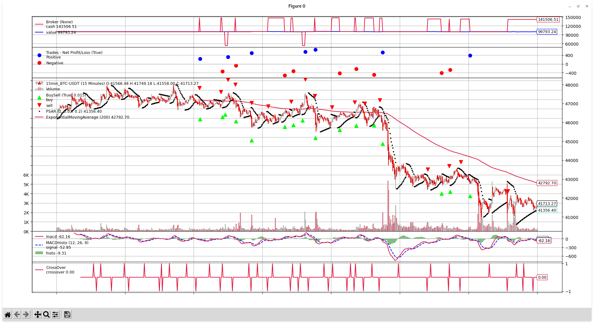
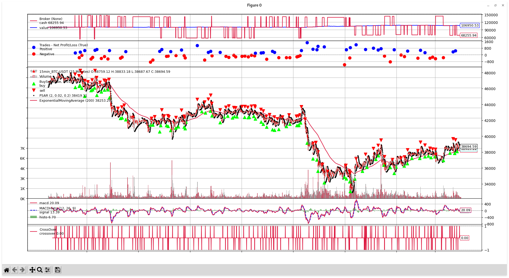
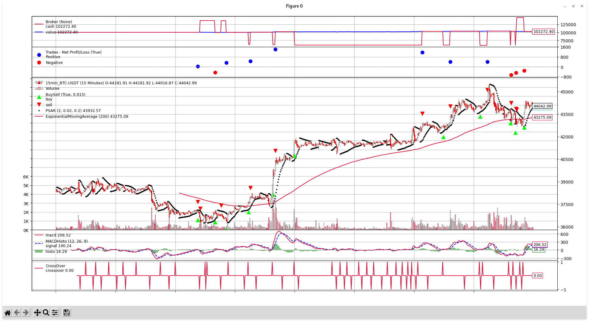
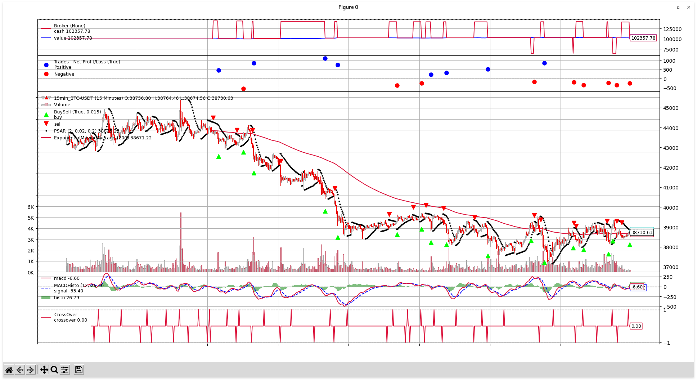

## Progetto di Fondamenti di intelligenza artificiale

### Introduction

The project is a program that performs backtesting of a trading strategy (applied to the Bitcoin/US Dollar pair). Bitcoin is used for this project (but it can easily be adapted to other cryptocurrencies) because the cryptocurrency market is always open and generally simpler compared to the traditional market, thus avoiding complexities unrelated to the project's objective. However, with some minor modifications, this program also works with traditional stock market shares.


### Strategy

The strategy used is explained in [this video](https://www.youtube.com/watch?v=sbKTRVWppZY).

In summary, it uses three indicators:

1. [MACD (Moving Average Convergence Divergence)](https://en.wikipedia.org/wiki/MACD):
   - Calculated using 3 Exponential Moving Averages (EMAs) with periods of 12, 26, and 9, respectively.
   - The 12 EMA and the 26 EMA are subtracted to calculate the *MACD Line*.
     - Highly sensitive to price changes.
   - The *Signal Line* is calculated as a 9 EMA of the MACD Line.
     - Less sensitive to price changes.
   - When the MACD Line crosses above the Signal Line (bullish crossover), it generates a buy signal, and vice versa for a bearish crossover (MACD Line crosses below Signal Line).
   - Optionally, you can introduce a histogram representing the difference between the MACD Line and the Signal Line, but it's not mandatory.

   

2. [Parabolic SAR (PSAR)](https://en.wikipedia.org/wiki/Parabolic_SAR):
   - Represented as a series of points.
   - If the points are below the candles, they indicate a bullish trend.
   - If the points are above the candles, they indicate a bearish trend.

   

3. [200EMA (Exponential Moving Average)](https://en.wikipedia.org/wiki/Moving_average):
   - Represents an exponential moving average with a period of 200.
   - If it's below the candles, it indicates a bullish trend.
   - If it's above the candles, it indicates a bearish trend.

   

Positions are opened or closed based on the signals given by these indicators. In particular, a long (buy) position is initiated when:

1. The price is above the 200EMA.
2. There is a bullish crossover between the MACD Line and the Signal Line.
3. The PSAR values are below the candles.

Conversely, a short (sell) position is initiated when:

1. The price is below the 200EMA.
2. There is a bearish crossover between the MACD Line and the Signal Line.
3. The PSAR values are above the candles.

Furthermore, once an order (either long or short) is created, stop loss and take profit prices are calculated. These are target prices that, when reached, trigger orders to close the position. If the price reaches the take profit value, the position is closed at a profit. If it hits the stop loss, the position is closed at a loss (the stop loss is set to prevent excessive losses).

The stop loss is placed at the current PSAR value, while the take profit is set to ensure a risk-reward ratio of 1:1. Formally:


The code is:

```python
def calculate_stop_loss_and_take_profit(self):
    # Calculate take profit and stop loss
    self.take_profit = self.dataclose[0] * 2 - self.psar[0]
    self.stop_loss = self.psar[0]
```

In `dataclose[0]`, you have the closing price of the last candle, while in `psar[0]`, you have the last calculated value of PSAR.

The calculation is the same for both long and short positions.

Once the stop loss and take profit are calculated, an OCO (One Cancels the Other) order is created. This is a set of orders where the first one executed cancels all the others. In this case, there will be two orders: one to close the position at the stop loss and one at the take profit. When the price reaches one of these two values, the corresponding order is executed, the position is closed, and the other order is canceled.


### Observations

Compared to the strategy shown in the video, it was chosen to add an additional check on price fluctuations when a position is open. During the testing phase, it was observed that when the price crosses (downward if the position is long, upward if it is short) the 200EMA, most of the time it eventually reaches the stop loss. Therefore, in the event of this situation, it is advisable to close the position at the current price (i.e., the 200EMA), instead of waiting to reach the stop loss.

```python
# We have an open position
if not self.is_short_position:
    # Check if the price touches the 200EMA
    # If so, immediately close the position and delete the pending orders
    if self.data[0] < self.ema200[0]:
        # Long position LOSS
        self.sell(size=self.reward_long)
        self.cancel(self.oco_profit)
        self.cancel(self.oco_loss)
else:
    # Then check if the price touches the 200EMA
    # If so, immediately close the position and delete the pending orders
    if self.data[0] > self.ema200[0]:
        # Short position LOSS
        self.buy(size=self.reward_short)
        self.cancel(self.oco_profit)
        self.cancel(self.oco_loss)
```

First of all, it checks whether the current position is long or short. If it's long, it performs a price check: if the price is lower than the 200EMA, it closes the position (`self.sell(size=self.reward_long)`) and cancels any pending orders (those placed at stop loss and take profit values, i.e., the OCO orders). If the position is short, it checks if the price becomes higher than the 200EMA, and if it does, it closes the position and cancels pending orders.

This check proves to be quite useful in the long term and during periods of price consolidation when there is neither a bullish nor a bearish trend, and many false signals are generated. For example, the following images represent a simulation without this check and one with the check (simulation start date: 01-03-2022, simulation end date: 17-03-2022):


It's worth noting how losses are contained in the second case (in the first case, it ends with \$94,543.69, and in the second case, with \$99,541.02, starting from \$100,000 in both cases).


### AIStrategy e Reward

Compared to the video, another modification has been made. The strategy [AIStrategy](Strategies/AIStrategy.py) (see the "Project Architecture" section) implements a mechanism based on rewards, which is useful for maximizing profit and/or limiting losses. The reward is updated every time a position is closed and can increase or decrease depending on whether the position was closed with a profit or a loss. Its value also represents the amount to invest in the next trade, which is influenced by the history of past trades (because they have modified the reward, which also represents the amount for this trade).

Each trade produces a **reward**. *The higher the reward, the more money will be invested in future trades.* *If the trade results in a profit, the overall reward increases; otherwise, it decreases.* The idea behind this is that if many consecutive trades result in a profit, then the trend is generally bullish (for long positions; bearish for short positions), so it's advisable to increase the stake to maximize gains. If, on the other hand, many trades result in a loss, it could be during a period of price consolidation with many false signals, so it's beneficial to reduce the amount of money per trade to minimize the potential for further losses.

Two variables are used to maintain the values of rewards: one for long trades (`reward_long`) and one for short trades (`reward_short`), both initialized to 1. These variables are passed as parameters to the function for opening a position (`self.buy(size=self.reward_long)` for long positions and `self.sell(size=self.reward_short)` for short positions) and represent the amount to invest (1 means 1 Bitcoin).

`reward_long` is modified after every long trade (i.e., when the trade is above the 200EMA): as explained earlier, if the position is opened at one price and closed at a higher price, `reward_long` increases; otherwise, it decreases.

`reward_short` is modified after every short trade (i.e., when the trade is below the 200EMA): if the position is opened at one price and closed at a lower price, `reward_short` increases; otherwise, it decreases.

For example, assuming that n past trades (n >= 1) have generated a profit (so the reward value is greater than 1, i.e., greater than the default value), it's likely that the current period has a strong bullish momentum. In this case, it might be advantageous to invest more in the next trade (i.e., instead of buying 1 Bitcoin, buy `reward_value` where `reward_value` > 1), because it's probable that it will also close with a profit. Conversely, if n past trades (n >= 1) have resulted in losses, it's likely that the current period doesn't have a well-defined momentum. Therefore, the probability of incurring further losses is not low, and it's advisable to invest less in the next trade (i.e., instead of buying 1 Bitcoin, buy `reward_value` where `reward_value` < 1) to be more cautious and, in the worst case scenario, limit additional losses.


The calculation of the reward is as follows: for each closed position, the difference between the selling price and the buying price is calculated, and the result is multiplied by a factor to normalize the value based on the price of the currency being traded and the total amount of money that can be invested (in this case, 0.0001 was chosen as the factor). Then, this value is added to the current value of `reward_long` if the just-closed position is a long one; otherwise, it's added to the current value of `reward_short` in the case of short positions.

Here is the code (for the sake of clarity, not all log or non-essential instructions for calculating the reward are included, although they are present in the complete code):

```python
# Check if an order has been completed
if order.status in [order.Completed]:
    if order.isbuy():
        self.buy_price = order.executed.price

        if self.is_short_position:
            # Update the reward for short positions
            self.reward_short += (self.sell_price - self.buy_price) * 0.0001

    elif order.issell():
        self.sell_price = order.executed.price

        if not self.is_short_position:
            # Update the reward for long positions
            self.reward_long += (self.sell_price - self.buy_price) * 0.0001
```

Additionally, if the price falls below the 200EMA, `reward_long` is reset to 1, as the bullish momentum has ended. Therefore, the next time the price rises above the 200EMA, it starts as if it were the first long trade. The same applies in a symmetrical manner to `reward_short`.


### Tools

For this project, the following tools and resources were used:

- [Backtrader](https://www.backtrader.com/) (with the Matplotlib module for chart visualization):
  - Backtrader is a Python library that allows for backtesting by applying trading strategies to asset data.
- [Binance API](https://binance-docs.github.io/apidocs/spot/en/#change-log):
  - Binance provides APIs for interaction with their exchange system, allowing you to retrieve information about markets or your personal account.
  - These APIs were used through the Python wrapper [python-binance](https://github.com/sammchardy/python-binance) to fetch price data and generate the file [15min_BTC-USDT.csv](datas/15min_BTC-USDT.csv), which contains all the prices for the BTC/USDT pair from 01/01/2022 to 30/03/2022 with a 15-minute timeframe.
    - The format of the file is as follows: `Datetime,Open,High,Low,Close,Volume`.
  - The code to generate this file can be found in [generate_data.py](Utils/generate_data.py).
    - Of course, you can modify all the parameters such as the chosen pair, the period, the timeframe, and so on.


### Project Architecture

The project has been organized as follows:

- The script [backtest.py](backtest.py) is the script to run to start the simulation.
  - It handles parsing of input arguments (currently, only the start and end dates, both optional), performs initial setup, executes the simulation with the selected strategy, and finally prints the results and opens a window with the chart.
- In the [Strategies](Strategies) folder, you can find all the implemented strategies. Currently, there are two: [AIStrategy](Strategies/AIStrategy.py), which represents the strategy of this project, and testStrategy, which can be seen as an initial test to ensure everything works correctly (taken from Backtrader's documentation).
  - *Note that by combining the first two points, you can run backtest.py using different strategies, for example, by passing the strategy you want to test as a parameter, and compare them with each other.*
  - The AIStrategy class implements the following methods (only those derived from the Backtrader Strategy superclass are listed):
    - log(): useful for seeing when an order is executed, with price, type, timestamp, and profit.
    - \__init__(): executed at the beginning to initialize various indicators and variables.
    - next(): the heart of the strategy. It is executed at each candle and is responsible for performing various calculations to determine what needs to be done. For example, it calculates whether there has been a MACD crossover, checks if there is an open position or not, and based on that, it checks whether to open or close positions.

- The script [generate_data.py](Utils/generate_data.py) inside the Utils folder is used to generate datasets, as explained in the previous chapter.
- In the [datas](datas) folder, you can find the datasets, as explained in the previous chapter.

***This setup makes the system highly flexible, and it's potentially possible to test it with different strategies, different datasets (including different timeframes), different intervals, and so on.***


### Results

Below are some charts derived from simulations of different periods (and a comparison is made between the strategy that implements reward calculation and the same strategy without reward).

- From 01-01-2022 to 08-01-2022 (1 week, default parameters)
- From 01-01-2022 to 08-01-2022 (1 week, default parameters, no reward)
- From 01-01-2022 to 15-01-2022 (2 weeks)
- From 01-01-2022 to 15-01-2022 (2 week, no reward)
- From 01-01-2022 to 01-02-2022 (1 month)
- From 01-01-2022 to 01-02-2022 (1 month, no reward)
- From 01-01-2022 to 01-03-2022 (2 months)
- From 01-01-2022 to 01-03-2022 (2 months, no reward)
- From 01-02-2022 to 08-02-2022 (1 week)
- From 01-02-2022 to 08-02-2022 (1 week, no reward)
- From 01-03-2022 to 08-03-2022 (1 week)
- From 01-03-2022 to 08-03-2022 (1 week, no reward)

It can be observed that this strategy works better during periods when the price has a clear bullish or bearish direction, but less so when it is in a sideways trend. This is because during sideways trends, the indicators generate many more false signals, resulting in very low profits or even losses. For example, this is clearly seen in the first image, where the price remains stable for most days (around \$48,000) and frequently crosses above and below the 200EMA. The balance is abruptly broken to the downside on the fifth day (dropping to \$43,000, generating a profit by closing a short position), but then a new equilibrium is established (between \$43,000 and \$41,000). However, potential losses are minimized by the observation made earlier, which is to close positions if the price touches the 200EMA, which has proven to be quite effective.

In general, the above observations apply to all the other charts, and it is noticeable that when the price remains stable within a certain range, losses are more frequent compared to when it doesn't. This pattern is especially evident in longer-term charts, such as the one-month or two-month charts.

Regarding the discussion about reward, it is generally observed that it has performed relatively well. In fact, except for the first two examples (from 01-01-2022 to 08-01-2022 and from 01-01-2022 to 15-01-2022), where there is minimal loss (generally, for short periods, the difference is small), the version that implements reward calculation has generated more profit compared to the one that does not consider it. Positions are opened with larger investments, so both profits and losses have higher values compared to the version without reward if the previous reward is greater than 1 (they will be lower if it is less than 1, although this rarely happens, as if the reward becomes less than 1, it likely indicates a trend change will occur soon; for example, if the reward for long positions becomes less than 1, almost always shortly after, the price drops below the 200EMA, and thus, short positions are opened with their respective reward (remember that there are two separate variables)).

However, while the upper bound for taking profit always remains the take profit, the lower bound is not always the stop loss but can become the 200EMA. This greatly contributes to higher profits and containing the price of losses, resulting in more profit compared to the version without reward (as seen, for example, in the charts of the two implementations for 1 month and 2 months).
