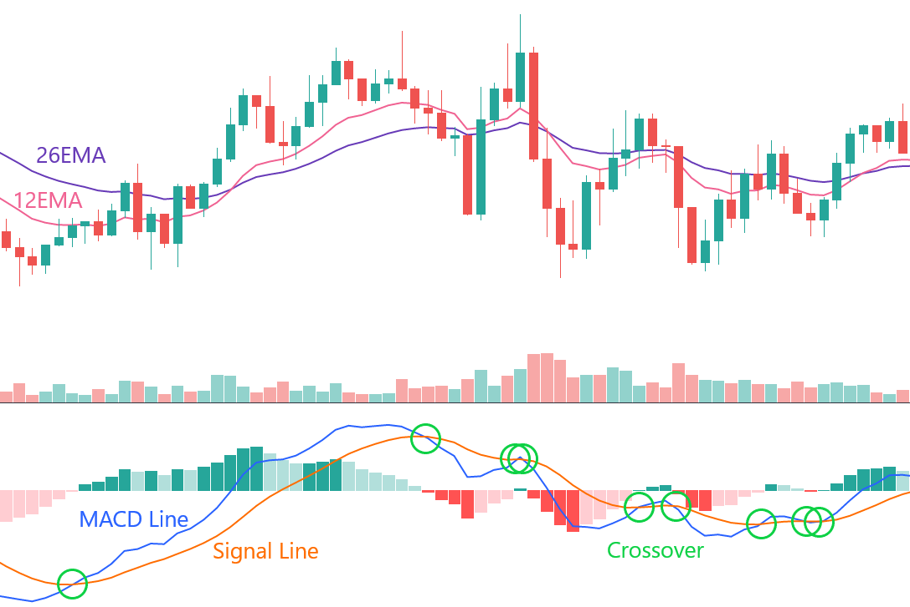
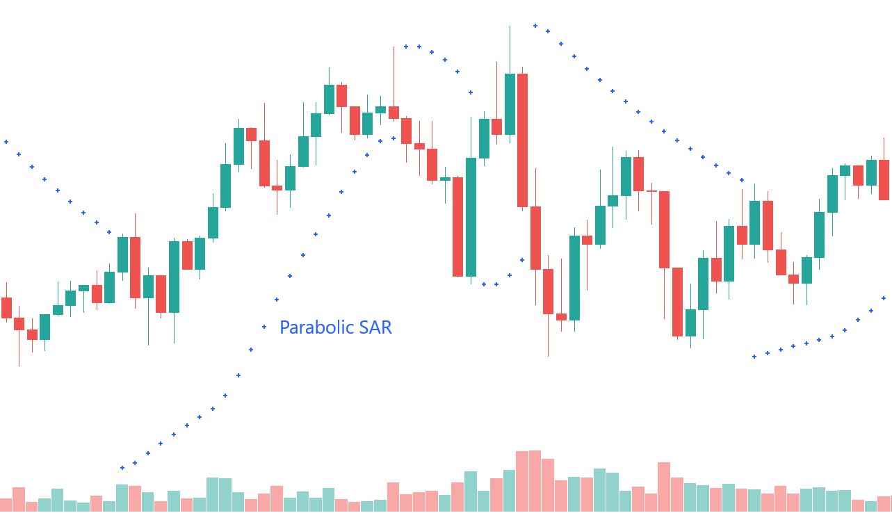
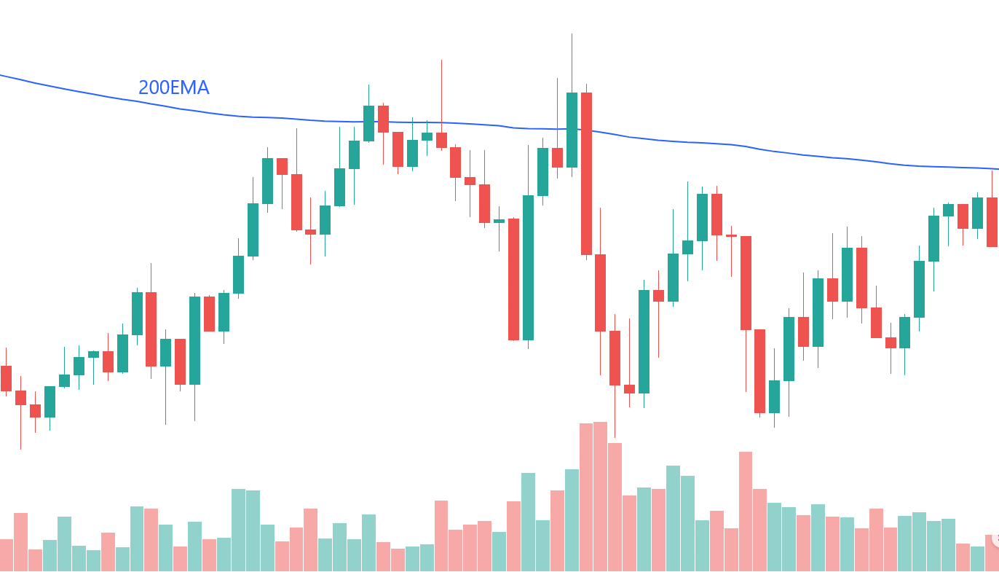
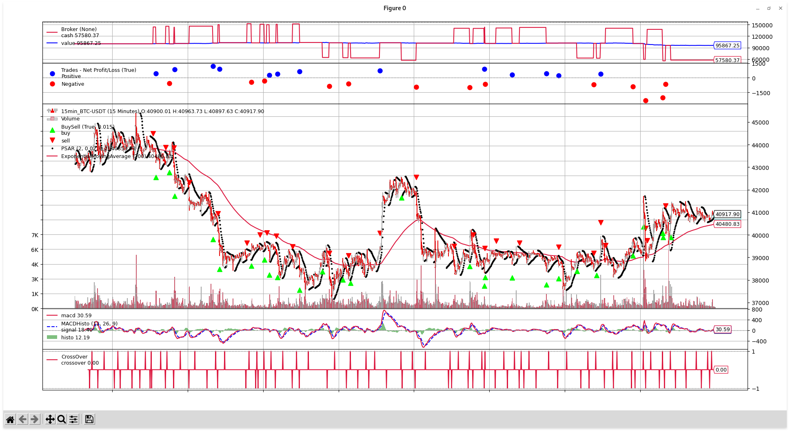
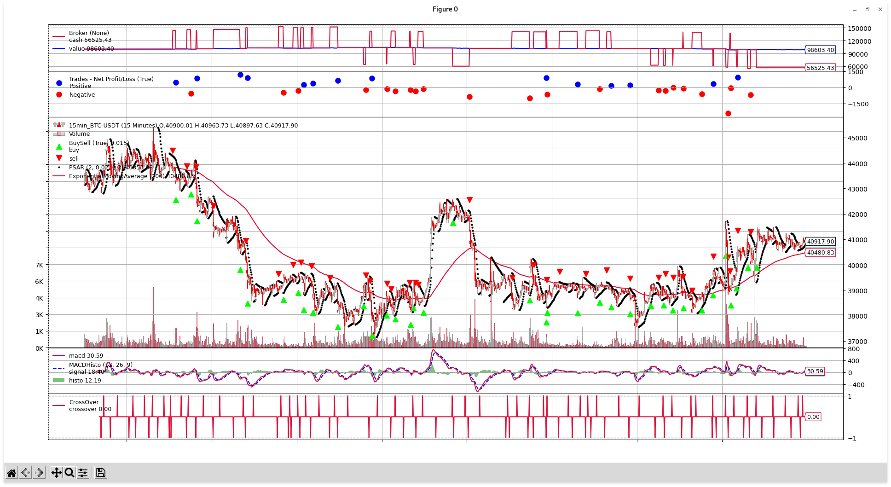
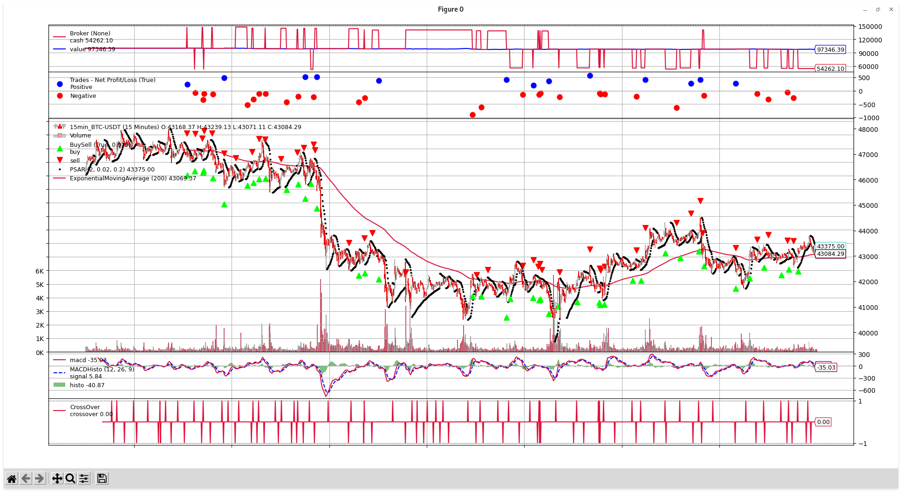
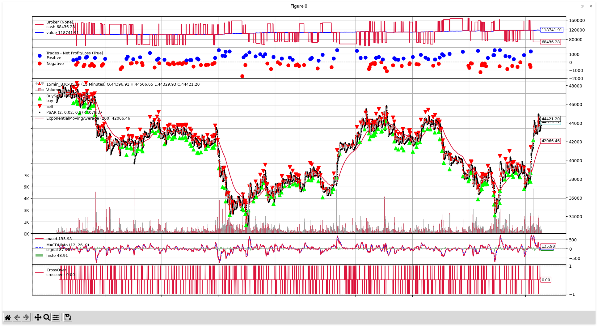
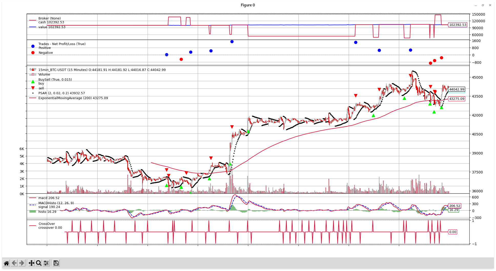

## Progetto di Fondamenti di intelligenza artificiale

### Introduzione

Il progetto è un programma che esegue backtesting di una strategia di trading (applicata alla coppia Bitcoin/Dollaro). Per questo progetto viene usato Bitcoin (ma è facilmente adattabile anche alle altre criptovalute) in quanto il mercato delle criptovalute è sempre aperto e in generale è più semplice rispetto a quello tradizionale, permettendo così di evitare delle complessità che non hanno a che fare con l'obiettivo del progetto, tuttavia, con qualche piccola modifica, questo programma funziona anche con le azioni del mercato tradizionale.


### Strategia

La strategia utilizzata viene spiegata [in questo video](https://www.youtube.com/watch?v=sbKTRVWppZY).
Riassumendolo utilizza tre indicatori:

- [MACD](https://en.wikipedia.org/wiki/MACD)
  - Calcolato usando 3 EMA rispettivamente di periodi 12, 26 e 9
  - La 12EMA e la 26EMA vengono sottratte tra di loro per calcolare la *MACD Line*
    - Molto sensibile al cambiamento del prezzo
  - Viene calcolata la *Signal Line*, cioè una 9EMA della MACD Line
    - Poco sensibile al cambiamento del prezzo
  - Quando la MACD Line e la Signal Line incrociano a rialzo (ovvero la MACD Line passa da sotto a sopra la Signal Line) è un segnale di acquisto, viceversa se incrociano a ribasso (la MACD Line passa da sopra a sotto la Signal Line) si genera un segnale di vendita
  - Opzionalmente è possibile introdurre anche un istogramma che rappresenta la differenza tra la MACD Line e la Signal Line, ma non è obbligatorio
  
  
  
- [Parabolic SAR (o PSAR)](https://en.wikipedia.org/wiki/Parabolic_SAR)
  - Rappresentato come una serie di punti
  - Se i punti sono sotto le candele, indicano un trend rialzista
  - Se i punti sono sopra le candele, indicano un trend ribassista
  
  
  
- [200EMA (Exponential Moving Average)](https://en.wikipedia.org/wiki/Moving_average)
  - Rappresenta una media mobile esponenziale con periodo 200
  - Se è sotto le candele, indica un trend rialzista
  - Se è sopra le candele, indica un trend ribassista
  
  

Osservando tutti i segnali dati da questi indicatori si aprono o chiudono le posizioni. In particolare si effettua un acquisto (si apre una posizione **long**) se 

1. il prezzo è sopra la 200EMA
2. c'è un crossover rialzista tra la MACD Line e la Signal Line
3. i valori di PSAR sono sotto le candele.

Viceversa si apre una posizione **short** se

1. il prezzo è sotto la 200EMA
2. c'è un crossover ribassista tra la MACD Line e la Signal Line
3. i valori di PSAR sono sopra le candele.

Inoltre, una volta creato l'ordine (sia esso long o short), vengono calcolati *stop loss* e *take profit*, ovvero dei prezzi target che, una volta raggiunti innescano degli ordini che chiudono la posizione.
Se il prezzo raggiunge il valore di take profit, allora significa che la posizione viene chiusa in profitto, se invece colpisce lo stop loss, allora significa che la posizione viene chiusa in perdita (lo stop loss viene messo per evitare di avere perdite troppo elevate).
Lo stop loss viene posto al valore attuale di PSAR, mentre il take profit viene posto facendo in modo che il rapporto del rischio guadagno-perdita sia 1:1. In formule:
$$
take\_profit = price * 2 - PSAR\newline
stop\_loss = PSAR
$$
In codice:

```python
def calculate_stop_loss_and_take_profit(self):
    # Calculate take profit and stop loss
    self.take_profit = self.dataclose[0] * 2 - self.psar[0]
    self.stop_loss = self.psar[0]
```

In `dataclose[0]` è presente il prezzo di chiusura dell'ultima candela, mentre in `psar[0]` l'ultimo valore calcolato di PSAR.

Il calcolo è lo stesso sia per posizioni long che posizioni short.

Una volta calcolati stop loss e take profit viene creato un ordine di tipo OCO (One Cancels the Other): è un insieme di ordini, dove il primo che viene eseguito cancella tutti gli altri. In questo caso gli ordini saranno 2: uno per chiudere la posizione allo stop loss e uno al take profit. Quando il prezzo raggiunge uno dei due valori, viene eseguito l'ordine corrispondente, chiusa la posizione e cancellato l'altro ordine.


### Osservazioni

Rispetto alla strategia mostrata nel video, è stato scelto di aggiungere un ulteriore check sulle oscillazioni del prezzo quando c'è una posizione aperta. Nella fase di testing si è notato che quando il prezzo supera (al ribasso se la posizione è long, al rialzo se è short) la 200EMA, poi la maggior parte delle volte raggiunge lo stop loss. Dunque nel caso in cui si verifichi questa situazione, conviene chiudere la posizione al prezzo corrente (cioè la 200EMA), invece di aspettare di raggiungere lo stop loss. In codice:

```python
# We have an open position
if not self.is_short_position:
    # Check if the price touches the 200EMA
    # If so, immediately close the position and delete the pending orders
    if self.data[0] < self.ema200[0]:
        # Long position LOSS
        self.sell(size=self.reward_long)
        self.cancel(self.oco_profit)
        self.cancel(self.oco_loss)
else:
    # Then check if the price touches the 200EMA
    # If so, immediately close the position and delete the pending orders
    if self.data[0] > self.ema200[0]:
        # Short position LOSS
        self.buy(size=self.reward_short)
        self.cancel(self.oco_profit)
        self.cancel(self.oco_loss)
```

Innanzitutto viene controllato se la posizione attuale è di tipo short o long. Se è long viene fatto un check sul prezzo: se è minore della 200EMA allora chiude la posizione (`self.sell(size=self.reward_long)`) e vengono cancellati gli ordini pendenti (quelli posti ai valori di stop loss e take profit, cioè gli ordini OCO). Se invece la posizione è short, si controlla se il prezzo diventa maggiore della 200EMA e, se lo è, viene chiusa la posizione e vengono cancellati gli ordini pendenti.

Questo controllo, sul lungo termine e in periodi di lateralizzazione del prezzo in cui non c'è né una spinta rialzista né ribassista, e si generano molti falsi segnali, si rivela abbastanza utile. Per esempio le seguenti immagini rappresentano rispettivamente una simulazione senza questo controllo e una con il controllo (data di inizio simulazione: 01-03-2022, data di fine simulazione: 17-03-2022):





Si noti come le perdite vengono contenute nel secondo caso (si passa da 95867.25 a 98603.40, partendo in entrambi i casi da 100000).


### Reward

Ogni trade produce un **reward**. *Più il reward è alto, più soldi verranno investiti nei futuri trade.*
*Se il trade produce un profitto, il reward complessivo cresce, altrimenti diminuisce.* L'idea che c'è dietro è che se tanti trade consecutivi producono profitto, allora la tendenza è generalmente rialzista (per posizioni long; ribassista se si parla di posizioni short), quindi conviene aumentare il carico per massimizzare il guadagno. Se invece tanti trade producono una perdita, potrebbe essere durante un periodo di lateralizzazione del prezzo, con molti falsi segnali e quindi conviene ridurre l'ammontare di soldi per trade per minimizzare il valore di altre possibili perdite.

Vengono usate due variabili per mantenere il valore dei reward: una per i trade long (`reward_long`) e una per quelli short (`reward_short`), entrambe inizializzate a 1. Queste vengono passate come parametro alla funzione per aprire una posizione (`self.buy(size=self.reward_long)` per posizioni long e `self.sell(size=self.reward_short)` per posizioni short) e rappresentano l'amount da investire (1 significa 1 Bitcoin).
`reward_long` viene modificata ad ogni trade di tipo long (cioè sopra la 200EMA): come spiegato precedentemente se la posizione viene aperta a un prezzo e chiusa a un prezzo più alto, `reward_long` cresce, altrimenti diminuisce.
`reward_short` viene modificata ad ogni trade di tipo short (cioè sotto la 200EMA): se la posizione viene aperta a un prezzo e chiusa a un prezzo più basso, `reward_short` cresce, altrimenti diminuisce.

Il calcolo del reward è il seguente: per ogni posizione che viene chiusa, viene calcolata la differenza tra il prezzo di vendita e quello di acquisto e il risultato moltiplicato per un fattore per normalizzare il valore in base al prezzo della valuta su cui si stanno eseguendo i trade e a quanti soldi complessivi si possono investire (in questo caso è stato scelto 0.0001 come fattore). Poi si somma questo valore al valore attuale di `reward_long` se la posizione appena chiusa è di tipo long, altrimenti si somma al valore attuale di `reward_short` nel caso di posizioni short.
Di seguito il codice (per motivi di chiarezza non vengono riportate tutte le istruzioni di log o non strettamente necessarie al calcolo del reward, anche se sono presenti nel codice completo):

```python
# Check if an order has been completed
if order.status in [order.Completed]:
    if order.isbuy():
        self.buy_price = order.executed.price

        if self.is_short_position:
            # Update the reward for short positions
            self.reward_short += (self.sell_price - self.buy_price) * 0.0001

    elif order.issell():
        self.sell_price = order.executed.price

        if not self.is_short_position:
            # Update the reward for long positions
            self.reward_long += (self.sell_price - self.buy_price) * 0.0001
```

Inoltre se il prezzo scende sotto la 200EMA, `reward_long` viene resettata a 1, in quanto il momentum rialzista è terminato, quindi la prossima volta che il prezzo risalirà sopra la 200EMA, si riparte come se fosse il primo trade long. Lo stesso discorso vale in maniera speculare per `reward_short`.


### Strumenti utilizzati

Per questo progetto sono stati utilizzati i seguenti strumenti:

- [Backtrader](https://www.backtrader.com/) (con modulo Matplotlib per la visualizzazione dei grafici)
  - Libreria python che permette di applicare delle strategie di trading sui dati dell'asset su cui si intende fare trading
- [Binance API](https://binance-docs.github.io/apidocs/spot/en/#change-log)
  - API fornite dall'exchange Binance
  - Permettono di interagire col sistema per ricavare informazioni sui mercati o sull'account personale
  - Usate attraverso il wrapper per python [python-binance](https://github.com/sammchardy/python-binance) per ricavare i dati sui prezzi e generare il file [15min_BTC-USDT.csv](datas/15min_BTC-USDT.csv), che contiene tutti i prezzi della coppia BTC/USDT dal 01/01/2022 al 30/03/2022 con un timeframe di 15 minuti
    - Il formato del file è il seguente: `Datetime,Open,High,Low,Close,Volume`
  - Il codice per generare il file è [generate_data.py](Utils/generate_data.py)
    - Ovviamente è possibile modificare tutti i parametri come la coppia scelta, il periodo, il timeframe, ...


### Risultati

Di seguito vengono riportati alcuni grafici derivati dalle simulazioni di periodi diversi.

- Dal 01-01-2022 al 08-01-2022 (1 settimana, parametri di default)
- Dal 01-01-2022 al 15-01-2022 (2 settimane)
- Dal 01-01-2022 al 01-02-2022 (1 mese)
- Dal 01-01-2022 al 01-03-2022 (2 mesi)
- Dal 01-02-2022 al 08-02-2022 (1 settimana)
- Dal 01-03-2022 al 08-03-2022 (1 settimana)

